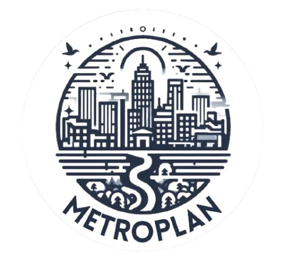

# MetroPlan - Game

"Sustainable Smart City" adalah sebuah Game Edukasi. Tujuan utamanya adalah untuk mengajarkan pemain tentang isu-isu keberlanjutan saat ini.

# About Project

Game ini adalah project akhir mata kuliah Pemrograman Game, Teknik Informatika, Semester V di Universitas Muhammadiyah Sukabumi.

# Team

* Gilang Fauzul Mubharak - 2230516001
* Rafida Zahra Mahirani H - 2130511064
* Natashya Welhelmina - 2130511093

# Game Concept 

Pemain akan diberi peran sebagai perencana kota perkotaan yang diatur dalam dunia yang nyata berbasis 2D. Tugasnya adalah mengubah kota menjadi kota yang berkelanjutan, ini akan menjadi permainan simulasi untuk membangun dan memanajemen kota yang terbagi menjadi beberapa level.

# About Assets

Semua assets (grafik, suara, dan musik) adalah gratis di Unity Asset Store dan aplikasi pihak ketiga lainnya.

# Run Game

Belum ada versi resmi dari Game ini.
Game ini dibuat di Unity 2022.3.11f1.
